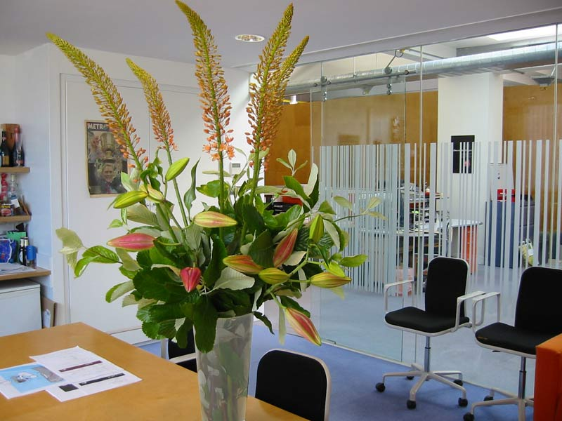

## Welcome to Arboreal web Page!

Arboreal är en prenumerationstjänst för företag. Tjänsten innebär att man får sitt kontor inrett med växter med hjälp av experter från Arboreal. Sedan betalar man en månadskostnad för att få nya växter levererade och placerade på kontoret varje månad eller vecka beroende på vilken prisplan man har valt. Arboreal har sin kundgrupp bland små till medelstora IT-företag i stockholmsområdet.

Feedback frn Julia Stålberg

Plus minus på designen!

PLUS:
Enkelt/stilrent.
Snyggt med orange detaljer.
Bra font på text.
Snygga linjer.
Bra att text inte är för nära kanter.
Snygga grids
Snyggt att du har sociala medier ikoner i dess egna färger när man hovrar.

MINUS:
Du kan ha lite letter-spacing så blir texten lite mer lättläst. 
Jag tycker du kan ha en fast storlek på ”drop us a line” fliken.
På contact borde de vara att man ska skriva in minst x antal tecken.
Kanske tydligare färg på hoover över ”send it!” Samma på ”exclusive”-”sign up now”.

Plus minus på koden!

PLUS:
Bra att du lagt kommentar i text var olika delar börjar.
Jag tycker det ser väldigt rent och bra ut!
Kan inte se så långa fel enligt mig.

MINUS:
Vad menar du med ”dropdown menu”? För jag ser ingen sån? Eller är det att du förberett det inför att du ska göra den responsiv?

Varför har du två div under ”section-theme”? Räcker det inte med 1?
Savr:
Det är två div en för row som har max-width: 1140px; och den diven row används för alla sections och den andra div är för själva theme section. 

Notis!
Ska bli kul att se den responsiv till nästa vecka! 

Bra jobbat Rooheed!!:grinning::+1:

### Markdown
<header>
<nav>

*   [Themes](#themes)
*   [Mission](#mission)
*   [Contact](#contact)
*   [Sign up](#sign-up)

</nav>

# A workplace that is  
a alive create ideas that live on.

[Choose a theme](#) [Pricing plans](#)

</header>

<section class="section-theme js--section-themes" id="themes">

## Our themes

> ### ALOHA
> 
> 

> ### SIBERIA
> 
> 

> ### EXOTIQUE NØRDIC
> 
> 

</section>

<section class="section-mission" id="mission">

## Our mission

### Offfice manager

Birger Jarlsgatan 12  
Stockholm  
Tel: 08-56 57 30  
Facebook: arboreal, Twitter: @arborea

</section>

´

<section class="section-plans js--section-plans" id="sign-up">

## Our pricing plans

### Standard

$399 / month

Best price ever!

*   Watering not included
*   No change of dead plants

[Sign up now](#)

### Premium

$499 / month

Best price ever!

*   Watering includedd
*   Exchange of dead plants

[Sign up now](#)

### Exclusive

$799 / month

Best price ever!

*   Web-controlled automated
*   Change of dead plants
*   Surveillence system
*   Only locally grown plants

[Sign up now](#)

</section>

´
<section class="section-feature">

*   <figure class="image-photo"></figure>

*   <figure class="image-photo"></figure>

*   <figure class="image-photo"></figure>

*   <figure class="image-photo"></figure>

*   <figure class="image-photo"></figure>

*   <figure class="image-photo"></figure>

*   <figure class="image-photo"></figure>

*   <figure class="image-photo"></figure>

</section>

´

<section class="section-form" id="contact">

## We're happy to hear from you

<form method="post" action="#" class="contact-form">

<label for="name">Name</label>

<input type="text" name="name" id="name" placeholder="Your name" required="">

<label for="email">Email</label>

<input type="email" name="email" id="email" placeholder="Your email" required="">

<label for="find-us">How did you find us?</label>

<select name="find-us" id="find-us"><option value="friends" selected="">Friends</option> <option value="search">Search engine</option> <option value="ad">Advertisment</option> <option value="other">Other</option></select>

<label>Newsletter</label>

<input type="checkbox" name="newa" id="news" checked=""> Yes, please

<label>Drop us a line</label>

<textarea name="message" placeholder="Your message"></textarea>

<label> </label>

<input type="submit" value="Send it!">

</form>

</section>

<footer>

*   [About us](#)
*   [Blog](#)
*   [Press](#)

*   
*   
*   
*   

Copyright © 2017 by Arboreal. All rights reseved.

</footer>

### Support or Contact

Rooheed Gulistani
Copyright © 2017 Rooheed Gulistani
